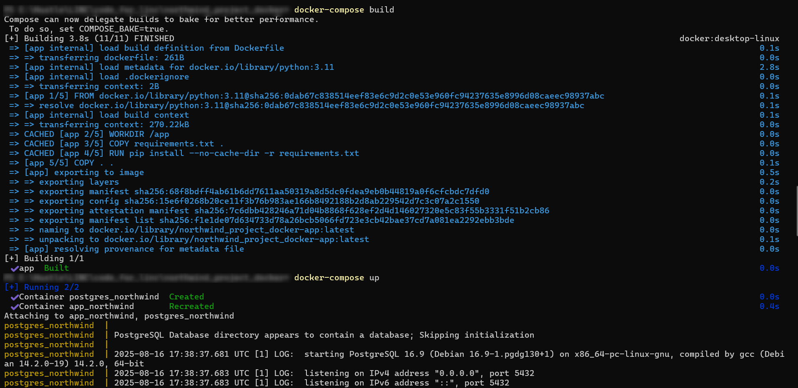
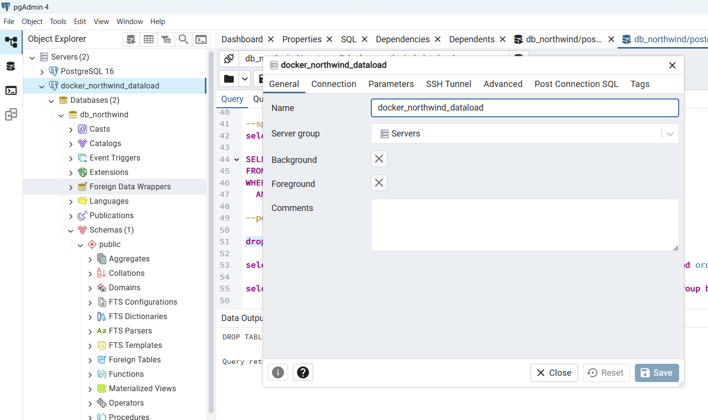
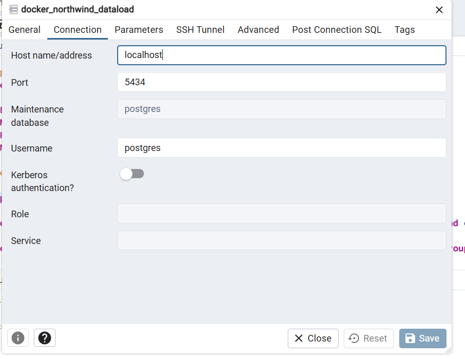
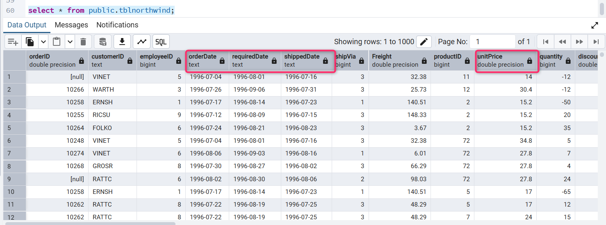

# Creating a Data Pipeline with Quality Checks

## Step 1: Start Docker with the Updated File Provided by the Business

Navigate to your local folder where the **northwind** project folder is present.  
(You can use the complete folder provided here.)

[northwind_project_docker](https://github.com/LD-LINC/Week-4---Data-Processing-Fundamentals/tree/73a9c7cf6291f9117234872348b8ce47cb32c43b/03_Data_pipeline_design_and_data_quality/Solution/northwind_project_docker)

Build and run Docker with the updated file:

```bash
docker-compose build
```

```bash
docker-compose up
```

Keep your Docker container up and running throughout this exercise.

<p align="center">
   


</p>

## Step 2: Connect to the Database Instance from Docker (Port 5434) Using pgAdmin 4

Use pgAdmin 4 to connect to the Postgres instance running in Docker on port 5434. Provide your username and password as per the dockersetup.

Refer to the provided screenshots for details.

<p align="center">
   


</p>


<p align="center">
   


</p>

## Step 3: Explore the Table from pgAdmin 4

From pgAdmin 4, explore the table public.tblnorthwind. Notice inconsistencies in data types and column names.

<p align="center">
   


</p>

## Step 4: Create a Python Script to Build the Pipeline with Corrected Data

Check the provided Python script to see the complete explanation of the pipeline implementation, including:

- Data loading
- Data transformation
- Quality checks
- Error handling
- Final fact table creation

[Data_pipeline](https://github.com/LD-LINC/Week-4---Data-Processing-Fundamentals/blob/a3760c04d8d841b2787cabb8d31e4e5455f39303/03_Data_pipeline_design_and_data_quality/Solution/Data%20pipelie%20with%20quality%20checks.ipynb)


