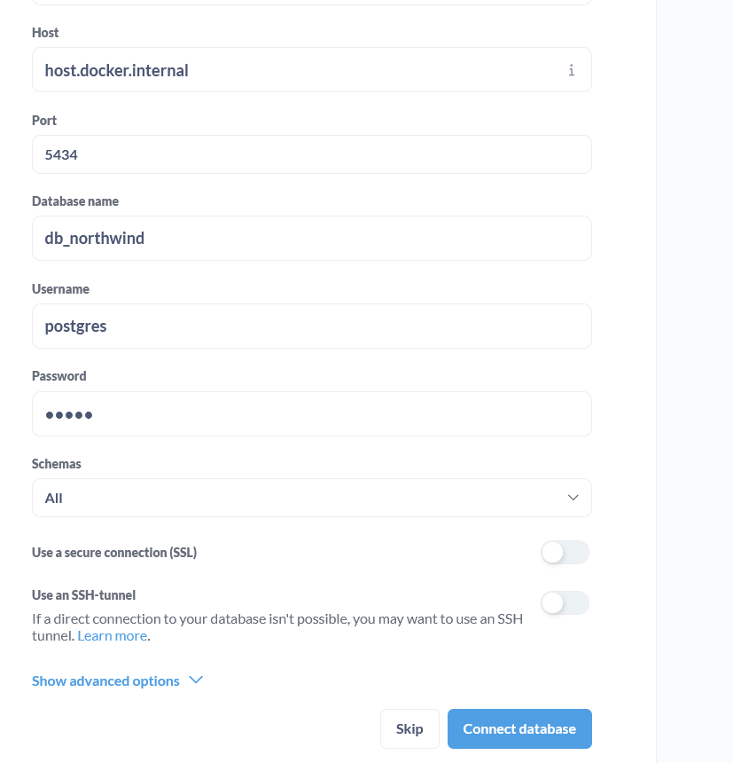
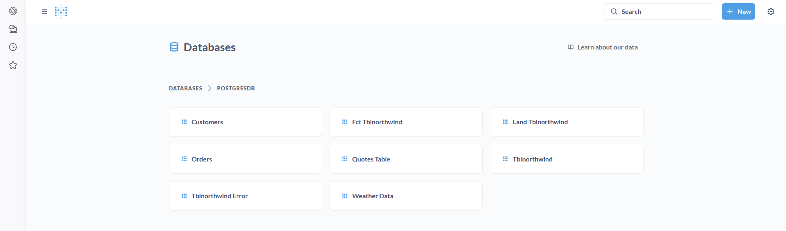

# Instructions: Designing a Production-Grade Enriched Data Pipeline and Loading into Metabase

## Project Overview

This project builds on top of the exercise completed in **Chapter 3**.  
We will start with our fact database table `fct_tblnorthwind` and enrich it with external data sources:

1. **Weather Data**: Retrieve historical weather information for Berlin using the Open-Meteo Archive API.  
2. **Quotes Data**: Perform web scraping from "Quotes to Scrape" to collect motivational quotes.  
3. **Data Integration**: Merge the enriched data into the fact table, create reporting tables, and visualize everything in **Metabase**.

By the end of this project, you will have a **production-grade enriched data pipeline** feeding data into Metabase.

---

## Learning Goals

* Understand how to enrich data pipelines using API integration and web scraping.  
* Learn how to transform and merge external data into existing fact tables.  
* Practice designing reporting tables for analytics.  
* Learn how to connect data pipelines to visualization tools like Metabase.  

---

## Step-by-Step Instructions

### Step 1: Ensure Docker is Running
Make sure your Docker environment from Exercise 3 is still up and running. Confirm the containers are active before proceeding.

---

### Step 2: Enrich Data with External Sources

Perform the following steps in sequence:

#### 2.1 Retrieve Order Dates  
Extract all order dates from the fact table `fct_tblnorthwind` and prepare them for use in API calls. Output should be a list with all orderdates.

#### 2.2 Fetch Weather Data  
Use the Open-Meteo Archive [API](https://open-meteo.com/en/docs/historical-weather-api) to fetch weather data for Berlin based on the order dates.  
- Use Berlin’s latitude and longitude.  
- Collect the maximum and minimum daily temperatures.  
- Calculate the average temperature for each order date.  
- Store this data in a dedicated table called `weather_data`.

#### 2.3 Web Scrape Quotes  
Scrape the first five pages of the "Quotes to Scrape" website.  `http://quotes.toscrape.com`
- Extract the quote text.
- Store the results in a table named `quotes_table`.

#### 2.4 Enrich the Fact Table  
Enhance the main fact table with additional columns:  
- Add a column for average temperature (`avg_temp_order_date`) and populate it using the `weather_data` table.  
- Add a column for a random quote (`random_quote`) and fill it with randomly selected values from the `quotes_table`.

---

### Step 3: Create Reporting Tables

To simplify reporting and analytics, create two new reporting tables:

1. **Customers Table**  
   - Include the following fields:  
     - `customerid`  
     - `companyname`  
     - `contactname`  
     - `contacttitle`  
     - `random_quote`  

2. **Orders Table**  
   - Include the following fields:  
     - `orderid`  
     - `customerid`  
     - `orderdate`  
     - `requireddate`  
     - `shippeddate`  
     - `quantity`  
     - `avg_temp_order_date`  

---

### Step 4: Set Up Metabase

1. Download and run Metabase as a Docker container.  
2. Open Metabase in your browser.  
3. Connect Metabase to your Postgres database.  

Metabase official page: [metabase](https://www.metabase.com/)

[Running Metabase on Docker](https://www.metabase.com/docs/latest/installation-and-operation/running-metabase-on-docker)

1. Download and run Metabase as a Docker container.  Execute command `docker run -d -p 3000:3000 metabase/metabase`
2. Access Metabase from `http://localhost:3000/` . Provided your postgres details to connect to db from metabase.
   

   

3. Connect Metabase to your Postgres database.

   

