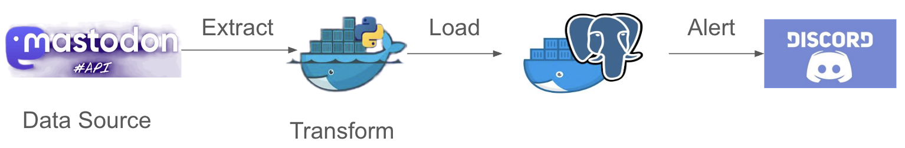
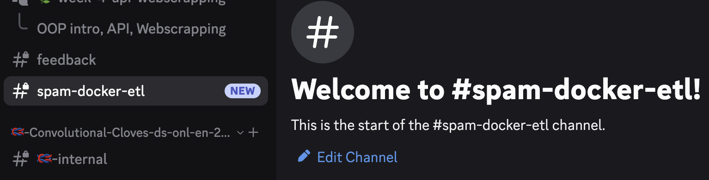
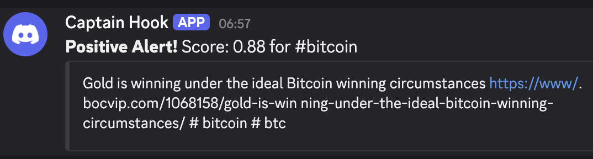

# Mastodon E-T-L Pipeline using Docker Compose for sentiment analysis and alerting.


[Mastodon](https://mastodon.social/about) is a free and open-source software for social networking with microblogging features similar to Twitter.

#### Components:
* Source: Mastodon REST API (Tagged Timeline).
    * https://docs.joinmastodon.org/methods/timelines/#tag
    * https://james.ashford.phd/2023/02/13/how-to-scrape-mastodon-timelines-using-python-and-pandas/
* Orchestration: Docker Compose (Manages all services).
* ETL Service (Python): Contains the core logic for the E-T-L steps, including data cleaning and sentiment analysis.
* Loading: PostgreSQL Database (analytics_db)
* Alerting: Discord Webhook (External integration for high-sentiment posts).

#### Project Structure
```
└── mastadon_ETL
    ├── README.md
    ├── docker-compose.yml
    ├── env_example
    └── etl_service
        ├── Dockerfile
        ├── etl_script.py
        └── requirements.txt
```
#### Files overview
* docker-compose.yml has been provided with 2 services (python and postgres)
* rename `env_example` to `.env` and provide the DISCORD_WEBHOOK_URL.
    * you can create your own webhooks in discord, check out [link](https://support.discord.com/hc/en-us/articles/228383668-Intro-to-Webhooks) 
    
    else add in the .env file.
    ```
    DISCORD_WEBHOOK_URL=https://discord.com/api/webhooks/1431136479454826588/_TuKOOHqfvowARtjMCeTJGtH4CXD4h3Lf25MUt1prAOuIEOc-5rNujlre6ldCvJQZ-Lm
    ``` 
    
    The messages for the above webhook will be published under

    
* Add code to the `Dockerfile` to containerize the python app under `etl_service/etl_script.py`
* Packages to install are provided in the `requirements.txt`
* A skeleton of the code has been provided in `etl_script.py` and all the places marked `...` needs your code input.
    * The transformation function of getting the sentiment score using [vaderSentiment](https://github.com/cjhutto/vaderSentiment/blob/master/README.rst) and the function to send msgs to discord via webhook has been provided.

#### To run the pipeline after all files are created and populated:
* Open your terminal in the `mastodon_ETL/` directory.
* Execute the build and run command:`docker-compose up --build -d` 
    * check the logs of the python container to troubleshoot issues
* When the sentiment of any of the posts / status crosses the threshold you will receive a msg in discord eg. as shown below



#### Additional improvements and challenges 
* 🌶️  Add error handling for all functions and retry mechanism while connecting to the DB
* 🌶️  Use SQLAlchemy instead of pycopg2
* 🌶️  Load the raw data extracted into a staging table before transforming
    * So now we will have 3 services that gets started when we build the containers through `yml` file 1 python app, 2 PostgresDB (raw, cleaned)
* 🌶️🌶️ In the previous activity we could only extract max of 40 posts ie. getting all posts in 1 page. To extract data from multiple pages we can use pagination.
    * https://docs.joinmastodon.org/api/guidelines/#pagination
    * https://mastodonpy.readthedocs.io/en/stable/12_utilities.html
* 🌶️🌶️🌶️ Getting sentiments of streaming posts
    * https://mastodonpy.readthedocs.io/en/stable/10_streaming.html
    * You need to generate an access token for streaming
        * [Generate mastodon token](https://learn.adafruit.com/intro-to-mastodon-api-circuitpython/generate-your-mastodon-token)
        * https://mastodonpy.readthedocs.io/en/stable/10_streaming.html
        * [Getting Started with Mastodon API in Python](https://martinheinz.dev/blog/86)


